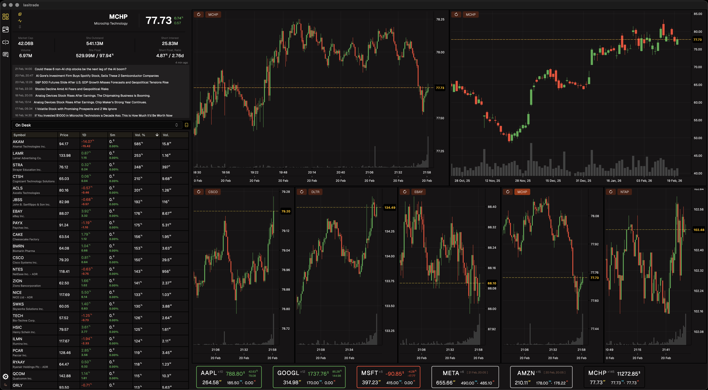
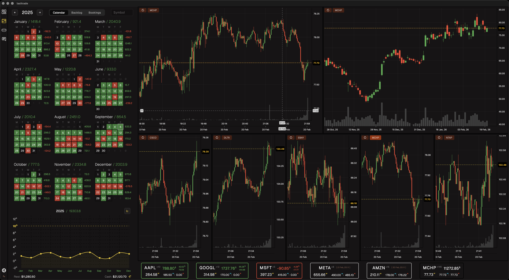

# LasiTrade

Flutter-based desktop trading application that integrates with the Saxo Bank
OpenAPI to provide real-time market data, trading, and portfolio management
capabilities - focused primarily on NASDAQ instruments.

--

Architecture

The project follows a clean MVVM (Model-View-ViewModel) pattern with a service
layer, using Provider for reactive state management and GetIt as a service
locator / dependency injection container.

--

 

--

License for LasiTrade Copyright (c) 2025 Ihar Petushkou

Permission is hereby granted to any person viewing this source code for personal
or educational purposes only.

Restrictions:

Non-Commercial Use Only

This source code or any part of it may not be used for commercial purposes.
Commercial use includes, but is not limited to, selling, licensing,
distributing, or incorporating it into a product or service that generates
revenue. No Redistribution or Derivative Works

This source code may not be copied, modified, redistributed, or included in
derivative works without explicit written permission from the copyright holder.
No Warranty or Liability

This source code is provided "as is," without any warranty, express or implied.
The author is not liable for any damages or consequences arising from the use or
misuse of this code. Personal Use Allowed: You are allowed to view, read, and
learn from this code for your own personal or educational purposes.

By accessing or viewing this source code, you agree to the terms of this
license. For any other use, please contact the copyright holder.
